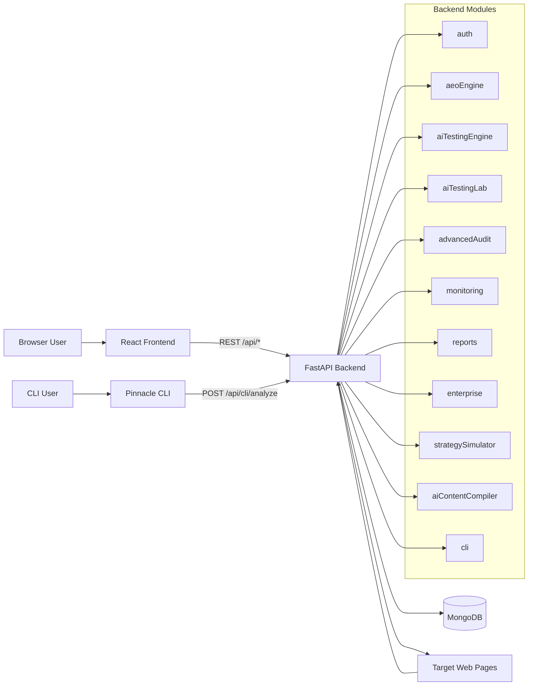

# Pinnacle.AI System Design

Version: 2026-04-01

## 1. Executive Summary
Pinnacle.AI is a full-stack AI visibility analysis platform. It evaluates web pages for AI engine discoverability and citation likelihood using deterministic scoring pipelines, then exposes findings through a React web app, FastAPI backend, MongoDB persistence, and a terminal CLI.

The architecture is modular and feature-oriented:
- Backend modules map directly to product capabilities (audits, AI testing, monitoring, reports, enterprise analysis, etc.).
- Frontend pages map directly to backend APIs via a centralized API client.
- Data is user-scoped in MongoDB and indexed for list/query patterns.
- Security controls include JWT auth, feature gating, rate limiting, and SSRF protection for URL analysis.

## 2. Product Scope
### 2.1 Core capabilities
- AEO page audit scoring (structure, trust, media, schema, technical).
- AI citation probability scoring for query + URL.
- GEO scoring (generative readiness, summarization resilience, brand retention).
- Advanced audit explainability and historical signal intelligence.
- AI Testing Lab multi-engine readiness comparison.
- Strategy simulation (what-if changes to improve score).
- Monitoring snapshots and change detection.
- Reports/analytics and enterprise competitor intelligence.
- CLI workflow with local HTML capture and backend scoring.

### 2.2 Access model
- Guest mode for selected trial experiences in frontend.
- Authenticated mode for persistent history and protected modules.
- Premium feature gating via plan/access flags.

## 3. High-Level Architecture

## 4. Repository Structure
- backend: FastAPI app, modules, middleware, DB layer, tests.
- frontend: React app (routes/pages/components), Tailwind/CSS design system, API client.
- cli: Python package for terminal usage.
- docker: local multi-container runtime.
- docs: architecture baseline doc.
- render.yaml, vercel.json: deployment config for backend/frontend split hosting.

## 5. Backend Design
## 5.1 Composition root
- Entry point: backend/server.py
- App lifecycle:
  - loads environment variables
  - configures CORS
  - registers middleware (security headers, rate limiting, logging)
  - registers module routers under /api
  - exposes /api/health
  - initializes Mongo indexes during lifespan

## 5.2 Middleware stack
- SecurityHeadersMiddleware
  - injects X-Content-Type-Options, X-Frame-Options, X-XSS-Protection, Referrer-Policy, Permissions-Policy.
- RateLimitMiddleware
  - in-memory token buckets:
    - per-IP: 100 req / 60s
    - per-user-token-hash: 60 req / 60s
- LoggingMiddleware
  - request method/path/status/latency logging.

## 5.3 Authentication and authorization
- JWT bearer tokens via PyJWT.
- auth_middleware provides:
  - verify_token (required auth)
  - verify_token_optional (guest + logged-in paths)
- auth module:
  - register/login/password change/current user retrieval
  - API key generation for CLI via long-lived JWT (~10 years)
- feature_access middleware:
  - premium feature checks against plan/isSubscribed/isFoundingUser
  - raises UpgradeRequiredException -> server returns 403 with error payload

## 5.4 Data access layer
- DB connection and index setup in backend/database/connection.py.
- Collections:
  - users
  - audits
  - ai_tests
  - monitored_pages
  - page_snapshots
  - page_change_logs
- Notable indexes:
  - users.email unique
  - audits/ai_tests user_id + created_at
  - monitored_pages (user_id, url) unique
  - snapshots/change_logs by monitored_page_id and timestamp

## 5.5 Module-by-module internals
### auth
- Password hashing: bcrypt.
- Token generation includes user_id/email/exp/iat.
- Founding/privileged access normalized to plan=founder.

### aeoEngine
- Pipeline:
  1. fetch page content
  2. parse HTML
  3. classify page type
  4. build signal object
  5. compute category scores + overall weighted score
  6. generate recommendations
- Scoring weights:
  - overall = 0.25 structure + 0.20 trust + 0.15 media + 0.25 schema + 0.15 technical

### page fetch subsystem
- Unified service: page_fetch_service.py
- Strategy:
  - fetch-first HTTP path (fast)
  - browser fallback using Playwright when blocked/incomplete
- Controls:
  - URL scheme validation
  - private/localhost SSRF blocking
  - cache TTL 120s
  - HTML max size 5MB
  - browser render rate limit per requester
- headless_renderer has hardened browser settings, resource blocking, timeouts.

### aiTestingEngine
- Query-aware citation pipeline:
  - query tokenization + intent detection
  - content match computation
  - extractability scoring
  - authority scoring
  - schema support + content depth
  - weighted citation probability
- Citation probability weights:
  - 0.25 intent_match
  - 0.25 extractability
  - 0.20 authority
  - 0.15 schema_support
  - 0.15 content_depth
- GEO integration:
  - run_geo_analysis returns geo_score and sub-dimensions
- Output includes gaps and improvement suggestions.

### advancedAudit
- Re-runs core audit + citation + GEO + explainability.
- Explainability per category:
  - contributing factors
  - penalties
  - detected signals
  - evidence
- Historical intelligence joins recommendation issues with monitored signal history.
- Additional async endpoints:
  - ai-skip-reason
  - priority-fixes
- LLM augmentation:
  - optional OpenAI usage if OPENAI_API_KEY exists
  - deterministic fallback when unavailable/failing

### aiTestingLab
- Multi-engine readiness using per-engine weight profiles.
- Engines currently implemented in code:
  - chatgpt
  - perplexity
  - google_sge
  - copilot
- Readiness formula:
  - 50% weighted engine signals + 50% query relevance
- Produces rank, grade, weaknesses, strengths, and targeted improvements.

### aiContentCompiler
- Converts parsed page into semantic blocks:
  - definition, FAQ, summary, list, comparison, authority blocks
- Computes compilation_readiness score from semantic coverage.

### strategySimulator
- Applies hypothetical modifications to parsed/signal state
- Recomputes citation probability and delta without changing source page
- Strategies:
  - addFAQ
  - addSummary
  - addSchema
  - improveAuthority

### monitoring
- Adds monitored URLs per user.
- Stores append-only snapshots (signals_json + page_type + fetched_at).
- Detects diffs against previous snapshot and logs change entries with impact.

### reports
- Overview: counts, averages, recent activity.
- Trends: audit/test trends + weekly aggregation + deltas.
- Competitors: URL-level score comparison via aggregation pipelines.

### enterprise
- compare: primary URL vs up to 5 competitors for same query.
- sensitivity-test: recompute probability with alternate weighting modes.
- executive-summary: deterministic portfolio health synthesis.

### cli backend module
- Accepts URL + raw HTML + optional query for analysis.
- Designed to avoid local crawling/network issues by analyzing caller-provided HTML.

## 6. Frontend Design
## 6.1 App shell and routing
- Entry: frontend/src/App.js
- Routing: frontend/src/routes/AppRoutes.js
- Auth context wraps app and controls route protection.
- Route groups:
  - public marketing/trial routes
  - authenticated app-shell routes
  - premium-gated routes with upgrade prompts

## 6.2 Frontend state model
- AuthContext stores token/user/loading and handles login/register/logout/me refresh.
- useGuestMode hook tracks session guest quotas for selected features.
- Page-level local state handles forms, loading, and result rendering.

## 6.3 API integration
- Single API client module: frontend/src/api.js.
- Backend base URL from REACT_APP_BACKEND_URL.
- Auth header from localStorage token.
- One function per backend endpoint group.

## 6.4 UI architecture
- Major pages:
  - Dashboard
  - Audits
  - AI Tests
  - AI Visibility Lab
  - AI Testing Lab
  - Advanced Audit
  - Monitoring
  - Reports
  - Simulator
  - Competitor Intel
  - Executive Summary
  - Profile
  - CLI docs
- Shared layout:
  - Navbar + Sidebar + Footer patterns
  - Feature locked modal + guest limit modal
- Styling:
  - Tailwind + custom design tokens in index.css
  - dark layered surfaces, indigo primary, glass-card naming (solid-surface behavior)

## 7. API Surface
All routes are mounted under /api.

| Method | Path | Auth | Purpose |
|---|---|---|---|
| GET | /api/health | public | service + DB health |
| POST | /api/auth/register | public | signup |
| POST | /api/auth/login | public | signin |
| GET | /api/auth/me | required | current user |
| POST | /api/auth/change-password | required | password update |
| POST | /api/auth/api-key | required + premium | CLI token |
| POST | /api/audit | optional | run AEO audit |
| GET | /api/audit | required | list audits |
| GET | /api/audit/{audit_id} | required | audit detail |
| POST | /api/audit/advanced | required + premium in UI | advanced audit |
| POST | /api/audit/advanced/{audit_id}/ai-skip-reason | required | async narrative |
| POST | /api/audit/advanced/{audit_id}/priority-fixes | required | ranked fix list |
| POST | /api/ai-test | optional | run AI citation + GEO |
| GET | /api/ai-test | required | list tests |
| GET | /api/ai-test/{test_id} | required | test detail |
| POST | /api/ai-testing-lab/run | optional | multi-engine lab |
| POST | /api/ai-testing-lab/quick-score | optional | single-engine quick score |
| GET | /api/ai-testing-lab/engines | public | engine catalog |
| GET | /api/ai-testing-lab/engines/{engine_id} | public | engine details |
| POST | /api/compile | required | semantic compile |
| POST | /api/simulate-strategy | required + premium | what-if simulation |
| POST | /api/monitor | required | add monitored page |
| GET | /api/monitor | required | list monitored pages |
| POST | /api/monitor/{page_id}/refresh | required | new snapshot + diff |
| GET | /api/monitor/{page_id}/snapshots | required | snapshot history |
| GET | /api/monitor/{page_id}/changes | required | change log |
| DELETE | /api/monitor/{page_id} | required | remove monitored page |
| GET | /api/reports/overview | required | summary metrics |
| GET | /api/reports/trends | required | trend analytics |
| GET | /api/reports/competitors | required | URL comparisons |
| POST | /api/enterprise/compare | required + premium | competitor comparison |
| POST | /api/enterprise/sensitivity-test | required | mode-based recalc |
| GET | /api/enterprise/executive-summary | required | executive synthesis |
| POST | /api/cli/analyze | required + premium | CLI analysis ingestion |

## 8. Data Model
## 8.1 users
- email, password_hash, nickname
- plan, isSubscribed, isFoundingUser, is_privileged
- created_at

## 8.2 audits
- user_id, url, query (advanced)
- overall_score
- breakdown_json
- signals_json
- recommendations
- page_type
- advanced flag
- citation_probability (advanced)
- geo_score (advanced)
- fetch_metadata
- created_at

## 8.3 ai_tests
- user_id, url, query, intent
- citation_probability
- engine_scores_json
- likely_position
- geo_score
- geo_scores_json
- detected_brand
- geo_breakdown_json
- geo_insights_json
- why_not_cited
- improvement_suggestions
- fetch_metadata
- created_at

## 8.4 monitored_pages
- user_id, url, created_at

## 8.5 page_snapshots
- monitored_page_id
- signals_json
- page_type
- fetched_at

## 8.6 page_change_logs
- monitored_page_id
- signal_name
- previous_value
- current_value
- impact
- detected_at

## 9. Core Runtime Flows
## 9.1 AEO audit flow
1. Client POST /api/audit.
2. Backend fetches page via fetch-first + browser fallback.
3. HTML parsed to structured fields.
4. Signals built and scored.
5. Recommendations generated.
6. For authenticated users, result persisted.
7. Response returns computed metrics.

## 9.2 AI test flow
1. Client submits URL + query.
2. Backend fetches and parses page.
3. Query intent + content matching computed.
4. Citation dimensions scored and aggregated.
5. GEO dimensions scored and aggregated.
6. Human-readable gaps/suggestions produced.
7. Result persisted for authenticated users.

## 9.3 Monitoring flow
1. Add monitored URL.
2. Initial snapshot stored.
3. Refresh endpoint captures new snapshot.
4. Diff detector compares tracked signals.
5. Change logs stored append-only.

## 9.4 Advanced audit async enrichment
1. Initial advanced audit returns core metrics quickly.
2. Frontend calls async endpoints for:
  - why AI skips reason
  - fix-this-first priority list
3. Backend uses LLM when configured; otherwise deterministic fallbacks.

## 10. Security and Compliance
- AuthN/AuthZ:
  - JWT bearer on protected routes
  - premium feature gating via plan flags
- Input protection:
  - URL/query validators for malformed/unsafe inputs
  - SSRF protections in fetcher and headless renderer
- Runtime controls:
  - per-IP and per-user in-memory rate limits
  - browser rendering limits and timeouts
- Response hardening:
  - security headers middleware
- Data handling policy:
  - architecture aims for ephemeral HTML processing (derived metrics persisted)
  - explicit HTML cleanup in service logic (del + gc.collect())

## 11. Deployment and Infrastructure
## 11.1 Local/dev
- Docker compose services:
  - mongodb
  - backend (uvicorn)
  - frontend (react-scripts)
- Backend defaults:
  - port 8001
- Frontend defaults:
  - port 3000

## 11.2 Cloud split deployment
- Backend: Render via render.yaml
- Frontend: static build + rewrites via vercel.json

## 11.3 Environment configuration
### Backend
- MONGO_URL
- DB_NAME
- JWT_SECRET
- JWT_EXPIRY_HOURS
- CORS_ORIGINS
- optional: OPENAI_API_KEY, OPENAI_MODEL (advanced audit augmentation)

### Frontend
- REACT_APP_BACKEND_URL

## 12. Observability and Operations
- Request logging with latency.
- Health endpoint with DB ping.
- Metadata capture around fetch method/source/render time.
- No dedicated metrics stack (Prometheus/OpenTelemetry) in current code.

## 13. Performance Characteristics
- Fetch path prioritizes lightweight HTTP before browser rendering.
- Browser path constrained by timeout and per-requester quota.
- DB queries indexed around user_id and timeline access patterns.
- Report pages aggregate server-side; frontend uses charts for rendering only.

## 14. Testing and Quality
- Integration-style backend tests under backend/tests.
- Additional external scripts at repository root for end-to-end API checks.
- Tests cover:
  - auth flows
  - audit and AI test endpoints
  - monitoring/report/enterprise endpoints
  - GEO-specific outputs and formula consistency

## 15. Architectural Risks and Gaps
1. Auth consistency mismatch across versions
- Some routes currently support optional auth while older tests assume strict auth.
- Recommendation: align policy per endpoint and update tests/docs consistently.

2. In-memory rate limiting is single-instance only
- Not shared across replicas; resets on restart.
- Recommendation: move to Redis-backed rate limit store for production scale.

3. Optional external LLM in advanced audit
- README claims fully deterministic analysis, but advanced audit has optional OpenAI generation.
- Recommendation: clarify docs: core scoring deterministic, narrative enhancement optional.

4. CLI package naming inconsistency
- setup.py name is pinnaclevault while command/docs refer to pinnacle-cli/pinnacle.
- Recommendation: normalize package metadata to reduce install confusion.

5. Logger namespace inconsistency
- Mixed logger names (pinnacle_ai, aeo_copilot, module-level).
- Recommendation: standardize logger naming and structured log schema.

6. HTML cleanup best-effort
- Explicit deletes occur in key services, but policy relies on coding discipline.
- Recommendation: add CI/static checks against HTML persistence fields and content logging.

## 16. Recommended Evolution Roadmap
1. Standardize auth and access policies
- Make endpoint auth mode explicit (public/optional/required/premium).
- Generate API contract docs from code.

2. Introduce shared infra controls
- Redis for rate limiting and short-lived fetch cache.
- Optional queue for browser fallback jobs under load.

3. Strengthen observability
- Add request IDs, structured JSON logs, error taxonomy.
- Add metrics: fetch source ratio, browser fallback rate, endpoint latency p95/p99.

4. Harden contract and schema governance
- Version API responses for major product surfaces.
- Add pydantic response models for major endpoints.

5. Expand testing pyramid
- Keep integration tests.
- Add deterministic unit tests around scorers and diff logic.
- Add frontend component tests for critical result cards and gating behavior.

## 17. Known Inconsistencies to Resolve
- Engine naming in docs vs code (docs mention additional engines not present in current engine profile map).
- Deterministic-only claim vs optional LLM augmentation in advanced audit.
- Legacy layout/component files coexist with active route-based shell; maintainers should mark deprecated files.

## 18. Appendix: Key Formulas
### AEO overall score
overall = 0.25*structure + 0.20*trust + 0.15*media + 0.25*schema + 0.15*technical

### Citation probability
citation_probability = 0.25*intent_match + 0.25*extractability + 0.20*authority + 0.15*schema_support + 0.15*content_depth

### GEO score
geo_score = 0.40*generative_readiness + 0.30*summarization_resilience + 0.30*brand_retention_probability

## 19. Assumptions and Unknowns
- No distributed worker system is present for long-running analyses; current design assumes synchronous request processing.
- No dedicated secret manager integration in code (environment variables used directly).
- No explicit multi-tenant org model; tenancy is user_id-scoped.
- No built-in audit/event stream for compliance evidence beyond request logs and stored analysis results.
